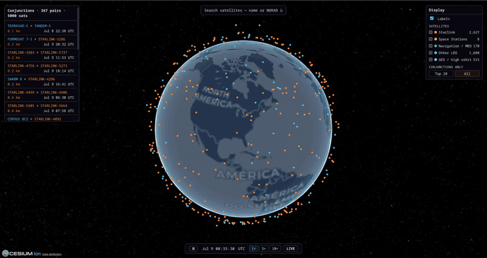
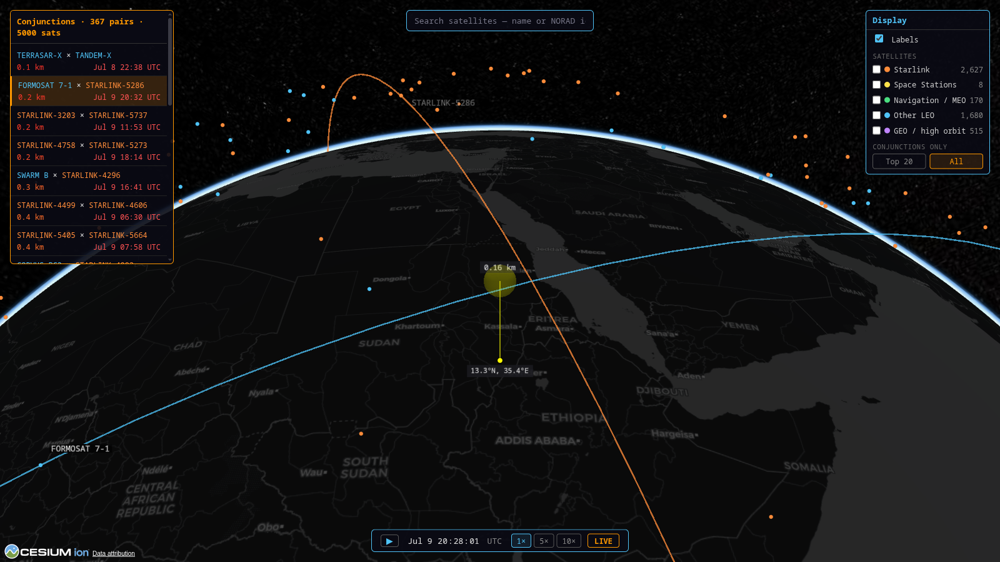

# OrbitWatch

**Live site: https://jtemblador.github.io/OrbitWatch/**

A satellite conjunction screener built from scratch: a C++ SGP4 propagation engine,
an industry-standard screening cascade, and a self-refreshing 3D globe that
screens **5,000 satellites for close approaches, 3×/day** — validated against
CelesTrak SOCRATES to **0.000 km agreement** on epoch-matched elements.

[](https://jtemblador.github.io/OrbitWatch/)

## What it is

- **Geometric conjunction screening**: time of closest approach (TCA), miss
  distance, relative speed, and the miss split into radial / along-track /
  cross-track (**RTN**) — using the 19 SDS **RTN screening ellipsoids** (SFS
  Handbook), not a naive distance sphere.
- **Not collision avoidance**: no probability of collision. Pc needs covariance
  data only satellite operators have; claiming it from public elements would be
  dishonest. This is screening on public GP data, and says so.

## How it works

```
GitHub Actions robot job (3×/day cron)
  fetch CelesTrak active catalog → C++ SGP4 screen (24 h window) → snapshot.json
        → publish to GitHub Pages  (+ append archive to a data branch)

Browser (static site — zero backend, zero per-visit upstream calls)
  snapshot.json → satellite.js SGP4 in a web worker → Cesium.js globe
```

The screening cascade: **coarse** altitude-band filter → **medium** time-stepped
C++ scan with a velocity-aware no-skip bound → **fine** batched Newton solve on
the relative range-rate (the standard operational TCA method) → RTN geometry.
The browser propagates every satellite client-side from orbital elements —
cross-validated at **0.00 m** against the C++ engine.



## Validation

Screened events are compared against **CelesTrak SOCRATES** (same method — SGP4 —
so agreement is measurable). Run twice per slice: once with today's element feed,
once with the **exact element vintage SOCRATES used** (Space-Track `gp_history`):

| Slice | Current elements | Epoch-matched elements |
|---|---|---|
| ISS (all partners) | 3/9 reproduced · median Δmiss 1.13 km | **8/9 · Δ 0.000 km** |
| Top-25 closest approaches | 8/25 · median Δmiss 2.58 km | **25/25 · Δ 0.000 km** |
| Starlink top-40 | 8/40 · median Δmiss 2.51 km | **40/40 · Δ 0.000 km** |

**The exact zeros are the point**: SGP4 is deterministic, so on identical inputs a
correct implementation must agree exactly; any residual would be our bug. The
left column measures **element-epoch drift** (km-scale in a day), which the
comparison isolates from method error. Engine accuracy: **< 1 m** vs. the
Vallado reference implementation.

📄 [Full validation report](validation/socrates_report.md) ·
[SGP4 accuracy & limits](validation/sgp4_uncertainty.md)

## Tech

| | |
|---|---|
| Propagation + screening | **C++** (from-scratch Vallado SGP4, pybind11), NumPy |
| Frames & transforms | TEME → ECEF via GMST, SPICE geodetics, RTN frame |
| Data | CelesTrak (OMM/JSON), Space-Track `gp_history` (validation) |
| Frontend | Cesium.js globe, satellite.js in a web worker, vanilla JS |
| Automation | GitHub Actions: build → screen → deploy + snapshot archive |
| Tests | **563 passing** — offline, deterministic, mutation-checked locks |

## Run locally

```bash
pip install -r requirements.txt pybind11

# Build the C++ engine
cd orbitcore && mkdir -p build && cd build
cmake -Dpybind11_DIR="$(python -m pybind11 --cmakedir)" .. && make -j
cp orbitcore*.so ../../backend/ && cd ../..

# Screen the catalog → the one data file the site reads
python scripts/build_snapshot.py --group active --max-sats 500 --hours 24

# Cesium token: copy frontend/js/config.example.js → config.js (free Ion account)
python -m http.server -d frontend 8000    # → http://localhost:8000
```

A FastAPI backend (`python backend/main.py`) exists for local development;
the deployed site is fully static.

## Project journal

Built Mar–Jul 2026. Every phase is logged — decisions, dead ends, measured
results, adversarial review rounds — in [`progress/`](progress/roadmap.md).
