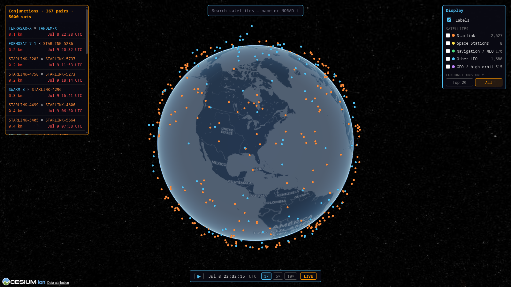

# OrbitWatch

**Live site: https://jtemblador.github.io/OrbitWatch/**

A satellite conjunction screener built from scratch. A C++ SGP4 propagation
engine screens the full active-satellite catalog (about 16,000 objects) for
close approaches, three times a day, and shows them on a self-refreshing 3D
globe. Every screen is checked against CelesTrak SOCRATES and agrees to
0.000 km on matched elements.

[](https://jtemblador.github.io/OrbitWatch/)

## What it is

Geometric conjunction screening: it finds when two satellites pass close and
reports the time of closest approach (TCA), the miss distance, the relative
speed, and the miss split into radial / along-track / cross-track (RTN). It uses
the RTN screening ellipsoids from the SFS (Space Flight Safety) Handbook, not a
plain distance sphere.

It is not collision avoidance. There is no probability of collision. That needs
covariance data only satellite operators have, and claiming it from public data
would be dishonest. This is honest screening on public orbital elements, and it
says so.

## How it works

```
GitHub Actions robot job (runs 3x a day)
  fetch CelesTrak active catalog -> C++ screen (24 h window) -> snapshot.json
       -> publish to GitHub Pages   (+ archive the snapshot to a data branch)

Browser (static site: no backend, no upstream calls per visit)
  snapshot.json -> satellite.js SGP4 in a web worker -> Cesium.js globe
```

The screen runs in stages, all in C++:

1. A coarse altitude filter drops pairs that can never get close.
2. A time-sieve checks each surviving pair only near its orbital node crossings,
   the points where two same-altitude orbits can actually meet. This removes
   most of the work (about 40x to 160x fewer pair checks).
3. A parallel Newton solver (OpenMP) finds the exact closest-approach time for
   what is left, with a superset ellipsoid pre-cut so only rows that might
   matter reach the reporting step.

Every stage gives the exact same events as a plain full scan. The payoff: a
screen of the whole catalog that used to need about 25 GB of memory (too big to
run in CI) now fits in about 5 GB and finishes in roughly 5 minutes.

The browser then propagates every satellite on its own from the orbital
elements, cross-checked at 0.00 m against the C++ engine.


## Build gate (CI/CD)

Speed means nothing if the fast path changes the answers, so the deploy pipeline
proves it does not, on real data, before anything ships:

- On a code change or manual rebuild, it fetches the catalog once, then runs an
  A/B check: screen it the fast way and the old simple way, and compare the two
  event lists. If a single event differs, the build fails and nothing deploys.
  Two tiers cover it: the full check at 5,000 satellites, and the time-sieve
  alone across the whole catalog (both kept within memory).
- The 3x-a-day cron job skips that check (it guards code, not data), re-screens
  with the already-proven engine in about 10 minutes, and appends each snapshot
  to an orphan `data` branch, so there is a record of what was published.

In CI on live data the fast and simple screens matched exactly: 308 == 308 and
3,887 == 3,887 events.

## Validation

Screened events are compared against CelesTrak SOCRATES, which uses the same
method (SGP4), so agreement is measurable. Each slice runs twice: once with
today's element feed, once with the exact element vintage SOCRATES used
(Space-Track `gp_history`):

| Slice | Current elements | Epoch-matched elements |
|---|---|---|
| ISS (all partners) | 3/9 reproduced, median miss 1.13 km | **8/9, 0.000 km** |
| Top-25 closest approaches | 8/25, median miss 2.58 km | **25/25, 0.000 km** |
| Starlink top-40 | 8/40, median miss 2.51 km | **40/40, 0.000 km** |

The exact zeros are the point. SGP4 is deterministic, so on identical inputs a
correct engine must agree exactly; any leftover difference would be our bug. The
left column shows element-epoch drift (a few km in a day), which the comparison
separates from method error. Engine accuracy: under 1 m against the Vallado
reference implementation.

[Full validation report](validation/socrates_report.md) ·
[SGP4 accuracy and limits](validation/sgp4_uncertainty.md)

## On the globe

- Search by name, NORAD id, or alias, and fly to any satellite.
- A conjunction list, closest first (the closest 500 of the full set), with
  show-more.
- Click one to fly to the moment of closest approach and watch it play out,
  with a marker on the ground below showing where and when it happens.
- Selecting an object shows only it and its conjunction partners, which also
  keeps the browser light. Escape steps back out one zoom level at a time.
- Group filters (Starlink, stations, navigation, other LEO, GEO) and time
  controls with rewind, pause, and forward (spacebar to pause).



## Tech

| | |
|---|---|
| Propagation + screening | C++ (from-scratch Vallado SGP4, pybind11, OpenMP), NumPy |
| Frames + transforms | TEME to ECEF via GMST, SPICE geodetics, RTN frame |
| Data | CelesTrak (OMM/JSON), Space-Track `gp_history` (validation) |
| Frontend | Cesium.js globe, satellite.js in a web worker, vanilla JS |
| Automation | GitHub Actions: fetch, A/B gate, screen, deploy, snapshot archive |
| Tests | 581 passing, offline, deterministic, mutation-checked |

## Run locally

```bash
pip install -r requirements.txt pybind11

# Build the C++ engine
cd orbitcore && mkdir -p build && cd build
cmake -Dpybind11_DIR="$(python -m pybind11 --cmakedir)" .. && make -j
cp orbitcore*.so ../../backend/ && cd ../..

# Screen the catalog into the one data file the site reads
# (--max-sats 500 for a quick run; drop it to screen the full catalog)
python scripts/build_snapshot.py --group active --hours 24 --max-sats 500

# Cesium token: copy frontend/js/config.example.js to config.js (free Ion account)
python -m http.server -d frontend 8000    # -> http://localhost:8000
```

A FastAPI backend (`python backend/main.py`) exists for local development; the
deployed site is fully static.

## Project journal

Built March to July 2026. Every phase is logged, with decisions, dead ends,
measured results, and review rounds, in [`progress/`](progress/roadmap.md).
