# OrbitWatch — SOCRATES Validation Report

_Generated 2026-06-27 07:29 UTC · Stage B — current GP vs. gp_history epoch-matched_

Does OrbitWatch's SGP4 conjunction screener reproduce the close approaches CelesTrak [SOCRATES](https://celestrak.org/SOCRATES/) publishes? This report runs our pipeline on the SOCRATES-flagged objects over the same window and measures the agreement.

## How to read this

- **Same method, on purpose.** SOCRATES (CelesTrak/STK) and OrbitWatch both propagate public SGP4 elements, so close agreement validates *our* implementation of a standard pipeline — it is not an independent-physics check.
- **Geometric screening, not collision avoidance.** We report TCA, miss distance and relative speed. No probability of collision (Pc) — that needs covariance data we do not have.
- **Epoch drift is the dominant error.** A current-GP feed (CelesTrak `gp.php` or Space-Track `gp`) serves only the *newest* element set, which has often rolled past the epoch SOCRATES screened from. `epoch_ok` flags each event where our element age at TCA still matches SOCRATES's reported `DSE`; where it does not, expect TCA/miss to drift. Reproduction therefore degrades with `DSE` (see the by-age tables).
- **5 km legacy-Euclidean screen** (matching SOCRATES's spherical 5 km gate), WGS-72 gravity + AFSPC mode — sub-km parity differences vs STK are expected.

## Results

### ISS (single primary)

- **3 / 9 reproduced** (33%)
- epoch-matched events: 0 · other crossings found (not in SOCRATES): 0 · objects unavailable: 0

| metric | median \|Δ\| | p95 \|Δ\| | max \|Δ\| |
|---|---|---|---|
| TCA (s) | 0.631 | 5.216 | 5.725 |
| miss distance (km) | 1.133 | 1.473 | 1.511 |

**Agreement by element age (DSE):**

| DSE | conjunctions | reproduced | rate | median \|ΔTCA\| (s) | median \|Δmiss\| (km) |
|---|---|---|---|---|---|
| <1d | 0 | 0 | 0% | — | — |
| 1-3d | 1 | 1 | 100% | 0.248 | 1.511 |
| >3d | 8 | 2 | 25% | 3.178 | 0.807 |

**Current GP vs. epoch-matched — the `gp_history` lever:**

| element source | reproduced | epoch-matched | median \|ΔTCA\| (s) | median \|Δmiss\| (km) |
|---|---|---|---|---|
| Space-Track current GP (latest) | 3/9 (33%) | 0 | 0.631 | 1.133 |
| Space-Track gp_history (epoch-matched) | 8/9 (89%) | 9 | 0.000 | 0.000 |

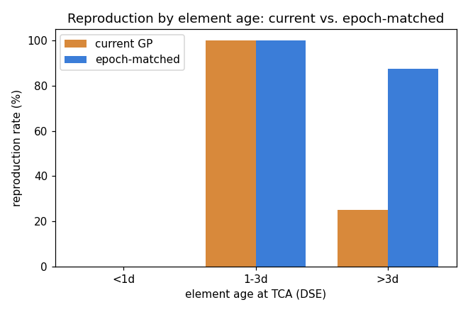
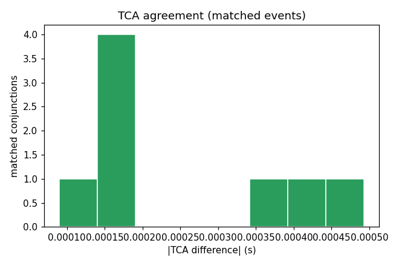
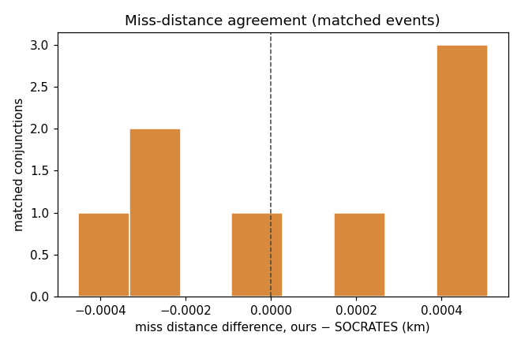
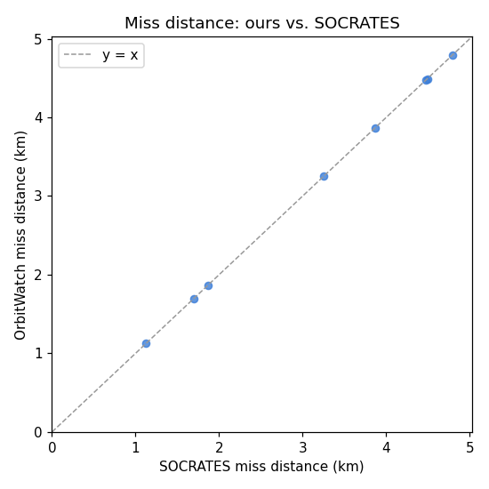

**Closest conjunctions (epoch-matched):**

| pair | SOCRATES TCA (UTC) | SOC miss (km) | ours miss (km) | ΔTCA (s) | Δmiss (km) | DSE | epoch |
|---|---|---|---|---|---|---|---|
| ISS (ZARYA) × NUSAT-38 (MARIA AGNESI) | 2026-06-28 13:57 | 1.125 | 1.125 | 0.0 | 0.000 | 2.5 | ✓ |
| ISS (ZARYA) × COLIBRI-S (RS67S) | 2026-06-29 07:31 | 1.695 | 1.695 | 0.0 | 0.000 | 3.2 | ✓ |
| ISS (ZARYA) × THORAD DELTA 1 DEB | 2026-06-29 08:43 | 1.868 | 1.868 | 0.0 | 0.000 | 3.4 | ✓ |
| ISS (ZARYA) × STARLINK-37691 | 2026-07-01 09:20 | 2.306 | missed | — | — | 5.3 | ✓ |
| ISS (ZARYA) × TIANMU-1 04 | 2026-07-01 18:51 | 3.249 | 3.249 | 0.0 | 0.000 | 5.6 | ✓ |
| ISS (ZARYA) × SWARM A | 2026-07-02 02:55 | 3.868 | 3.869 | 0.0 | 0.001 | 6.0 | ✓ |
| ISS (ZARYA) × OBJECT AK | 2026-07-02 22:22 | 4.471 | 4.471 | 0.0 | 0.000 | 7.0 | ✓ |
| ISS (ZARYA) × GHOST-3 | 2026-07-03 07:11 | 4.491 | 4.491 | 0.0 | 0.000 | 7.2 | ✓ |
| ISS (ZARYA) × SMDC ONE 2.4 | 2026-06-29 15:47 | 4.788 | 4.788 | 0.0 | 0.000 | 3.5 | ✓ |

### Top 25 closest

- **8 / 25 reproduced** (32%)
- epoch-matched events: 0 · other crossings found (not in SOCRATES): 30 · objects unavailable: 0

| metric | median \|Δ\| | p95 \|Δ\| | max \|Δ\| |
|---|---|---|---|
| TCA (s) | 0.298 | 4.991 | 7.260 |
| miss distance (km) | 2.584 | 4.713 | 4.923 |

**Agreement by element age (DSE):**

| DSE | conjunctions | reproduced | rate | median \|ΔTCA\| (s) | median \|Δmiss\| (km) |
|---|---|---|---|---|---|
| <1d | 0 | 0 | 0% | — | — |
| 1-3d | 6 | 3 | 50% | 0.051 | 2.757 |
| >3d | 19 | 5 | 26% | 0.411 | 2.411 |

**Current GP vs. epoch-matched — the `gp_history` lever:**

| element source | reproduced | epoch-matched | median \|ΔTCA\| (s) | median \|Δmiss\| (km) |
|---|---|---|---|---|
| Space-Track current GP (latest) | 8/25 (32%) | 0 | 0.298 | 2.584 |
| Space-Track gp_history (epoch-matched) | 25/25 (100%) | 25 | 0.000 | 0.000 |

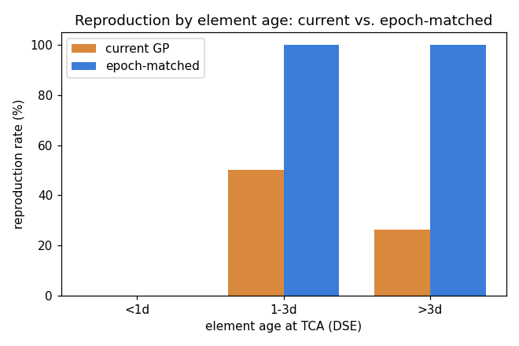
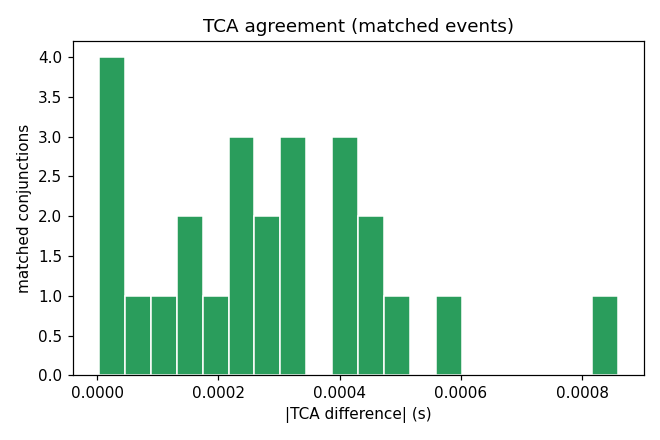
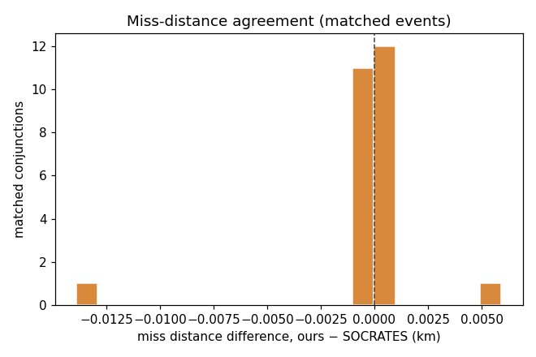
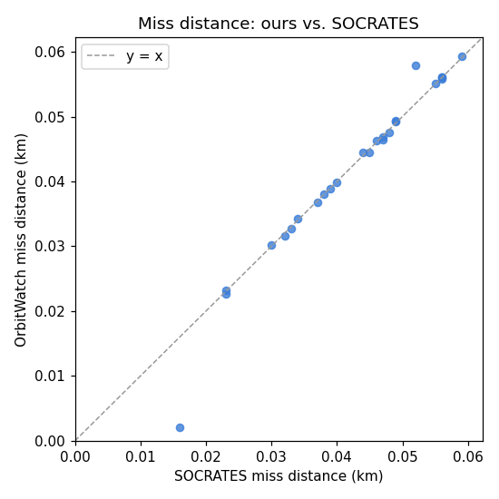

**Closest conjunctions (epoch-matched):**

| pair | SOCRATES TCA (UTC) | SOC miss (km) | ours miss (km) | ΔTCA (s) | Δmiss (km) | DSE | epoch |
|---|---|---|---|---|---|---|---|
| STARLINK-30878 × STARLINK-35467 | 2026-06-27 20:11 | 0.016 | 0.002 | 0.0 | -0.014 | 2.0 | ✓ |
| WT 1B × STARLINK-6164 | 2026-06-27 09:47 | 0.023 | 0.023 | 0.0 | 0.000 | 1.5 | ✓ |
| STARLINK-1373 × STARLINK-11741 | 2026-07-01 23:27 | 0.023 | 0.023 | 0.0 | 0.000 | 6.3 | ✓ |
| STARLINK-3005 × COSMOS 2228 | 2026-07-03 08:58 | 0.030 | 0.030 | 0.0 | 0.000 | 7.4 | ✓ |
| LYNK TOWER 4 × STARLINK-31680 | 2026-07-02 04:37 | 0.032 | 0.032 | 0.0 | 0.000 | 6.1 | ✓ |
| STARLINK-1626 × FLOCK 4BE-12 | 2026-06-29 07:26 | 0.033 | 0.033 | 0.0 | 0.000 | 3.7 | ✓ |
| LYNK TOWER 3 × STARLINK-34996 | 2026-06-29 13:57 | 0.034 | 0.034 | 0.0 | 0.000 | 3.9 | ✓ |
| STARLINK-5191 × HYDROGNSS-2 | 2026-06-30 04:12 | 0.037 | 0.037 | 0.0 | 0.000 | 4.6 | ✓ |
| SKYSAT-C6 × STARLINK-37527 | 2026-06-29 15:39 | 0.038 | 0.038 | 0.0 | 0.000 | 3.7 | ✓ |
| WEINA 2 × CZ-6A DEB | 2026-06-29 21:34 | 0.039 | 0.039 | 0.0 | 0.000 | 4.2 | ✓ |
| LEMUR-2-DELOITTE-1 × STARLINK-34385 | 2026-06-30 00:52 | 0.040 | 0.040 | 0.0 | 0.000 | 4.4 | ✓ |
| STARLINK-4358 × COSMOS 397 DEB | 2026-06-28 17:49 | 0.044 | 0.044 | 0.0 | 0.000 | 3.1 | ✓ |
| STARLINK-31721 × FLOCK 4G-9 | 2026-07-02 17:17 | 0.045 | 0.044 | 0.0 | -0.001 | 6.9 | ✓ |
| OBJECT AK × OBJECT F | 2026-06-27 13:34 | 0.046 | 0.046 | 0.0 | 0.000 | 1.4 | ✓ |
| SHIYAN-21 (SY-21) × STARLINK-36529 | 2026-06-28 07:18 | 0.047 | 0.046 | 0.0 | -0.001 | 2.5 | ✓ |

_…10 more not shown._

### Starlink (40 closest)

- **8 / 40 reproduced** (20%)
- epoch-matched events: 0 · other crossings found (not in SOCRATES): 102 · objects unavailable: 0

| metric | median \|Δ\| | p95 \|Δ\| | max \|Δ\| |
|---|---|---|---|
| TCA (s) | 0.378 | 4.951 | 7.260 |
| miss distance (km) | 2.513 | 4.713 | 4.923 |

**Agreement by element age (DSE):**

| DSE | conjunctions | reproduced | rate | median \|ΔTCA\| (s) | median \|Δmiss\| (km) |
|---|---|---|---|---|---|
| <1d | 1 | 0 | 0% | — | — |
| 1-3d | 11 | 4 | 36% | 0.388 | 2.513 |
| >3d | 28 | 4 | 14% | 0.328 | 2.680 |

**Current GP vs. epoch-matched — the `gp_history` lever:**

| element source | reproduced | epoch-matched | median \|ΔTCA\| (s) | median \|Δmiss\| (km) |
|---|---|---|---|---|
| Space-Track current GP (latest) | 8/40 (20%) | 0 | 0.378 | 2.513 |
| Space-Track gp_history (epoch-matched) | 40/40 (100%) | 40 | 0.000 | 0.000 |

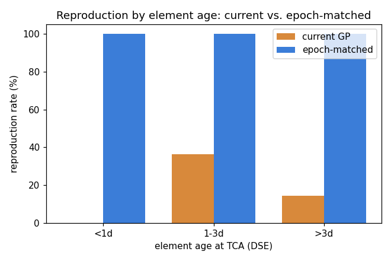
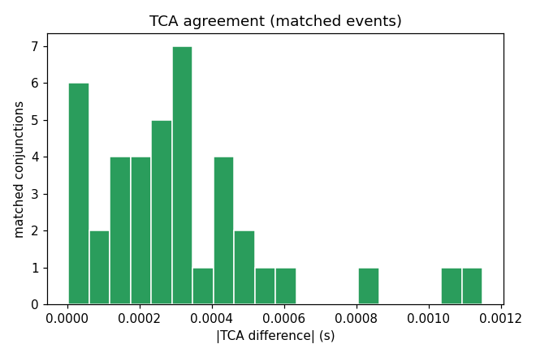
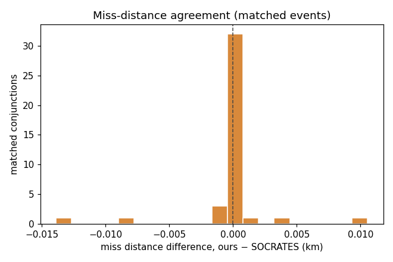
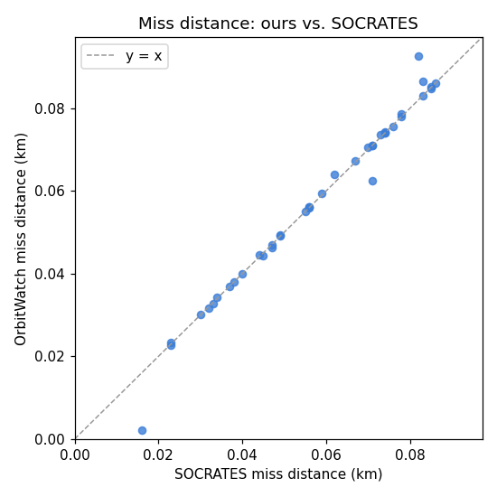

**Closest conjunctions (epoch-matched):**

| pair | SOCRATES TCA (UTC) | SOC miss (km) | ours miss (km) | ΔTCA (s) | Δmiss (km) | DSE | epoch |
|---|---|---|---|---|---|---|---|
| STARLINK-30878 × STARLINK-35467 | 2026-06-27 20:11 | 0.016 | 0.002 | 0.0 | -0.014 | 2.0 | ✓ |
| WT 1B × STARLINK-6164 | 2026-06-27 09:47 | 0.023 | 0.023 | 0.0 | 0.000 | 1.5 | ✓ |
| STARLINK-1373 × STARLINK-11741 | 2026-07-01 23:27 | 0.023 | 0.023 | 0.0 | 0.000 | 6.3 | ✓ |
| STARLINK-3005 × COSMOS 2228 | 2026-07-03 08:58 | 0.030 | 0.030 | 0.0 | 0.000 | 7.4 | ✓ |
| LYNK TOWER 4 × STARLINK-31680 | 2026-07-02 04:37 | 0.032 | 0.032 | 0.0 | 0.000 | 6.1 | ✓ |
| STARLINK-1626 × FLOCK 4BE-12 | 2026-06-29 07:26 | 0.033 | 0.033 | 0.0 | 0.000 | 3.7 | ✓ |
| LYNK TOWER 3 × STARLINK-34996 | 2026-06-29 13:57 | 0.034 | 0.034 | 0.0 | 0.000 | 3.9 | ✓ |
| STARLINK-5191 × HYDROGNSS-2 | 2026-06-30 04:12 | 0.037 | 0.037 | 0.0 | 0.000 | 4.6 | ✓ |
| SKYSAT-C6 × STARLINK-37527 | 2026-06-29 15:39 | 0.038 | 0.038 | 0.0 | 0.000 | 3.7 | ✓ |
| LEMUR-2-DELOITTE-1 × STARLINK-34385 | 2026-06-30 00:52 | 0.040 | 0.040 | 0.0 | 0.000 | 4.4 | ✓ |
| STARLINK-4358 × COSMOS 397 DEB | 2026-06-28 17:49 | 0.044 | 0.044 | 0.0 | 0.000 | 3.1 | ✓ |
| STARLINK-31721 × FLOCK 4G-9 | 2026-07-02 17:17 | 0.045 | 0.044 | 0.0 | -0.001 | 6.9 | ✓ |
| SHIYAN-21 (SY-21) × STARLINK-36529 | 2026-06-28 07:18 | 0.047 | 0.046 | 0.0 | -0.001 | 2.5 | ✓ |
| OBJECT B × STARLINK-36143 | 2026-07-01 20:45 | 0.047 | 0.047 | 0.0 | 0.000 | 5.7 | ✓ |
| STARLINK-1316 × OBJECT C | 2026-06-28 02:17 | 0.049 | 0.049 | 0.0 | 0.000 | 2.4 | ✓ |

_…25 more not shown._

## Limitations

How accurate is this, and why is it *screening* rather than collision avoidance? See **[sgp4_uncertainty.md](sgp4_uncertainty.md)** — the error budget, our SGP4 cross-validation, and the measured epoch-drift effect.

